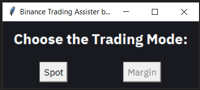
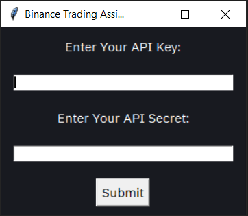
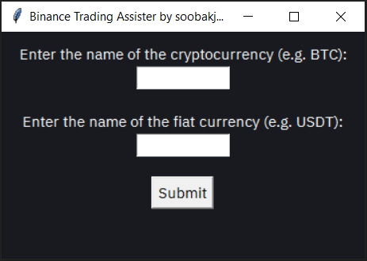

# Binance Trading Assister

## Preview

## Foreword
This application was made to enable trading on binance using only keyboard.

Margin Trading is not supported yet.

## Set Up
Please install the IBM Plex Sans font by selecting all the .ttf files in IBM_Plex_Sans folder and pasting them into
"C:\Windows\Fonts"

Run trade_assister.py to start.

## Assumptions
- The user uses only one crypto pair for trading
- The user's assets are contained only in Spot and Margin Accounts.

## Information
- The base fiat currency used in Record.xlsx is BUSD

### Commands
- b - Buy
- s - Sell
- t - Change trading currency between fiat and crypto
- c {1 ~ number of open orders} - Cancel an order. "c 1" or "c" will cancel the most recent created order and "c {number of current open orders}" will cancel the earliest created order.

To update:
- Trading Amount - Enter a number
- Order Book Number - Enter number between (0 ~ 9)
